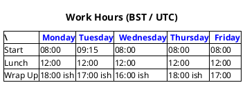
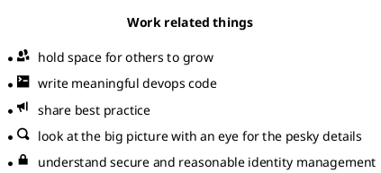

# Tess Barnes

## Mission

To make a visible positive impact on others: this could be humans, fauna, flora, ecosystems, organisational systems, knowledge bases, code 

And secretly, to faithfully serve my furry feline overlord :cat2:

## Interested in

- Eastern philospohy & matial arts: Be water my friend...
- Systems thinking
- Photography
- Music
- Writing

& many more

## Work related things
* :seedling: hold space for others to grow
* :floppy_disk: write meaningful devops code
* :mega: share best practice
* :mag: look at the big picture with an eye for the pesky details
* :closed_lock_with_key: understand secure and reasonable identity management

## Work hours (BST / UTC)

| | Monday  | Tuesday  | Wednesday  | Thursday  |  Friday |
|----|----|----|----|----|----| 
| Start | 08:00 | 09:15 | 08:00 | 08:00 | 08:00 |
| Lunch | 12:00 | 12:00 | 12:00 | 12:00 | 12:00 |
| Wrap Up | 18:00 ish | 17:00 ish | 16:00 ish | 18:00 ish  | 17:00 |

## Working at
Made Tech

as a Lead Software engineer 

so a (consultant for individuals and teams doing dev ops)

also a Mentor

also a Line Manager

also a Tech Coach

## Latest shiny
**caveat** may not be new, might be new to me or finding out how to use in a new way

- [Plant UML](https://plantuml.com/salt), salt (wireframes) - diagrams, views & layouts from code

### Examples

## Contact me for mentoring in
- coaching on your career journey
- technical concerns (docker, pipelines, apis, serverside languages)
- awkward conversations

## Give me feedback on
I love getting data to help me grow and focus on the right things to help folks. Gimme all the data! Slack, Bob, email all good. 

I'm happy with face to face but I will be listening and taking your gift away rather than discussing it on the hoof.

## Tea or Coffee?
Coffee in the mornings. Fresh ground is best.

Tea in the afternoons. Taking time for a cuppa is a good way to reset part way through the day.

## Current reading list
- [Be water my friend](https://www.goodreads.com/book/show/49247089-be-water-my-friend?ref=nav_sb_ss_1_8)
- [Systems 1: Introductions to Systems Thinking](https://www.goodreads.com/book/show/56676873-systems-1?ref=nav_sb_ss_1_14)
- [Crone of Elders Blaze](https://www.goodreads.com/book/show/202410491-the-crone-of-elders-blaze?ref=nav_sb_ss_4_9)

## Currently listening to
- [65 Days of Static - Under The Summs](https://www.65daysofstatic.com/under-the-summs-streaming-now-2/) 

